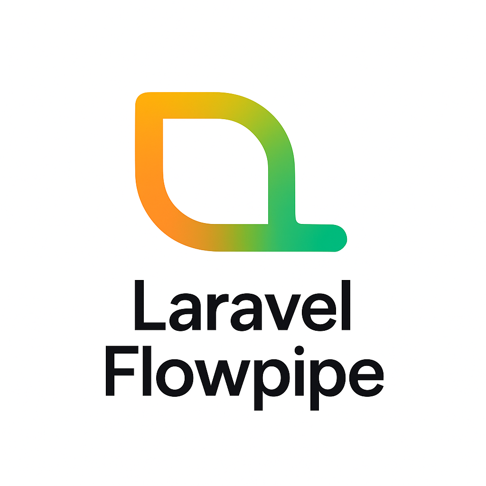

# Laravel Flowpipe

<div align="center">
  
  <p><strong>Composable, traceable and declarative Flow Pipelines for Laravel. A modern alternative to Laravel's Pipeline, with support for conditional steps, nested flows, tracing, validation, and more.</strong></p>

  [](https://packagist.org/packages/grazulex/laravel-flowpipe)
  [](https://packagist.org/packages/grazulex/laravel-flowpipe)
  [](LICENSE.md)
  [](https://php.net)
  [](https://laravel.com)
  [](https://github.com/Grazulex/laravel-arc/actions)
  [](https://github.com/laravel/pint)

</div>

<div style="background: linear-gradient(135deg, #FF9900 0%, #D2D200 25%, #88C600 50%, #00B470 100%); padding: 2rem; border-radius: 10px; margin: 2rem 0; color: white; text-shadow: 2px 2px 4px rgba(0,0,0,0.5);">

## 🚀 Overview

<strong style="color: #FFFFFF;">Laravel Flowpipe</strong> is a powerful, modern alternative to Laravel's built-in Pipeline package that provides <span style="color: #FFE066;">composable</span>, <span style="color: #B8E066;">traceable</span>, and <span style="color: #66E0B8;">declarative</span> flow pipelines. It extends the traditional pipeline concept with advanced features like <strong style="color: #FFCC66;">conditional logic</strong>, <strong style="color: #CCFF66;">nested workflows</strong>, <strong style="color: #66FFCC;">comprehensive error handling</strong>, and <strong style="color: #66CCFF;">YAML-based flow definitions</strong>.

Perfect for building complex business workflows, data processing pipelines, user registration flows, API integrations, and any scenario where you need reliable, maintainable, and testable step-by-step processing.

</div>

## <span style="color: #FF9900;">✨ Features</span>

✨ **<span style="color: #FF9900;">Fluent API</span>** - Chainable, expressive syntax  
🔄 **<span style="color: #D2D200;">Flexible Steps</span>** - Support for closures, classes, and custom steps  
🎯 **<span style="color: #88C600;">Conditional Logic</span>** - Built-in conditional step execution with dot notation  
📊 **<span style="color: #00B470;">Tracing & Debugging</span>** - Track execution flow and performance  
🧪 **<span style="color: #FF9900;">Test-Friendly</span>** - Built-in test tracer for easy testing  
🚀 **<span style="color: #D2D200;">Laravel Integration</span>** - Seamless service provider integration  
⚡ **<span style="color: #88C600;">Performance</span>** - Optimized for speed and memory efficiency  
📋 **<span style="color: #00B470;">YAML Flows</span>** - Define flows in YAML for easy configuration  
🎨 **<span style="color: #FF9900;">Artisan Commands</span>** - Full CLI support for flow management  
✅ **<span style="color: #D2D200;">Flow Validation</span>** - Validate flow definitions with comprehensive error reporting  
📈 **<span style="color: #88C600;">Export & Documentation</span>** - Export to JSON, Mermaid, and Markdown  
🔗 **<span style="color: #00B470;">Step Groups</span>** - Reusable, named collections of steps  
🎯 **<span style="color: #FF9900;">Nested Flows</span>** - Create isolated sub-workflows for complex logic  
🛡️ **<span style="color: #D2D200;">Advanced Error Handling</span>** - Comprehensive error handling with retry, fallback, and compensation strategies  
🔄 **<span style="color: #88C600;">Retry Strategies</span>** - Exponential and linear backoff, custom retry logic  
🎯 **<span style="color: #00B470;">Fallback Patterns</span>** - Graceful degradation with fallback mechanisms  
🔧 **<span style="color: #FF9900;">Compensation</span>** - Automatic rollback and cleanup operations  
🎨 **<span style="color: #D2D200;">Composite Strategies</span>** - Combine multiple error handling approaches  

## <span style="color: #D2D200;">📋 Requirements</span>

- **<span style="color: #FF9900;">PHP 8.3+</span>**
- **<span style="color: #88C600;">Laravel 12.0+</span>**

## <span style="color: #88C600;">🚀 Installation</span>

Install the package via **<span style="color: #FF9900;">Composer</span>**:

```bash
composer require grazulex/laravel-flowpipe
```

> <div style="border-left: 4px solid #88C600; padding: 1rem; background: #f8f9fa; margin: 1rem 0;">
> <strong style="color: #88C600;">💡 Auto-Discovery</strong><br>
> The service provider will be automatically registered thanks to Laravel's package auto-discovery.
> </div>

## <span style="color: #00B470;">⚡ Quick Start</span>

### <span style="color: #FF9900;">Basic Pipeline</span>

```php
use Grazulex\LaravelFlowpipe\Flowpipe;

$result = Flowpipe::make()
    ->send('Hello World')
    ->through([
        fn($data, $next) => $next(strtoupper($data)),
        fn($data, $next) => $next(str_replace(' ', '-', $data)),
        fn($data, $next) => $next($data . '!'),
    ])
    ->thenReturn();

// Result: "HELLO-WORLD!"
```

### <span style="color: #D2D200;">🛡️ Error Handling with Retry</span>

```php
use Grazulex\LaravelFlowpipe\Flowpipe;

// Exponential backoff retry
$result = Flowpipe::make()
    ->send(['api_url' => 'https://api.example.com/data'])
    ->exponentialBackoff(3, 100, 2.0) // 3 attempts, 100ms base delay, 2x multiplier
    ->through([
        fn($data, $next) => $next(callExternalAPI($data['api_url'])),
        fn($data, $next) => $next(processAPIResponse($data)),
    ])
    ->thenReturn();

// Linear backoff retry
$result = Flowpipe::make()
    ->send($userData)
    ->linearBackoff(3, 100, 50) // 3 attempts, 100ms base + 50ms increment
    ->through([
        fn($data, $next) => $next(saveToDatabase($data)),
    ])
    ->thenReturn();
```

### <span style="color: #88C600;">🎯 Fallback Strategies</span>

```php
use Grazulex\LaravelFlowpipe\Flowpipe;

// Simple fallback with default value
$result = Flowpipe::make()
    ->send(['user_id' => 123])
    ->withFallback(fn($payload, $error) => ['cached_data' => true, 'user_id' => $payload['user_id']])
    ->through([
        fn($data, $next) => $next(fetchUserProfile($data['user_id'])),
    ])
    ->thenReturn();

// Exception-specific fallback
$result = Flowpipe::make()
    ->send($orderData)
    ->fallbackOnException(NetworkException::class, fn($payload, $error) => getCachedOrderData($payload))
    ->through([
        fn($data, $next) => $next(fetchOrderFromAPI($data)),
    ])
    ->thenReturn();
```

### <span style="color: #00B470;">🔄 Compensation (Rollback) Strategies</span>

```php
use Grazulex\LaravelFlowpipe\Flowpipe;

// Automatic rollback on failure
$result = Flowpipe::make()
    ->send($transactionData)
    ->withCompensation(function ($payload, $error, $context) {
        // Rollback the transaction
        rollbackTransaction($payload['transaction_id']);
        return array_merge($payload, ['rolled_back' => true]);
    })
    ->through([
        fn($data, $next) => $next(processTransaction($data)),
    ])
    ->thenReturn();

// Exception-specific compensation
$result = Flowpipe::make()
    ->send($paymentData)
    ->compensateOnException(PaymentException::class, fn($payload, $error) => refundPayment($payload))
    ->through([
        fn($data, $next) => $next(chargePayment($data)),
    ])
    ->thenReturn();
```

### <span style="color: #FF9900;">🎨 Composite Error Handling</span>

```php
use Grazulex\LaravelFlowpipe\ErrorHandling\Strategies\CompositeStrategy;
use Grazulex\LaravelFlowpipe\ErrorHandling\Strategies\RetryStrategy;
use Grazulex\LaravelFlowpipe\ErrorHandling\Strategies\FallbackStrategy;

// Combine multiple strategies
$compositeStrategy = CompositeStrategy::make()
    ->retry(RetryStrategy::exponentialBackoff(3, 100, 2.0))
    ->fallback(FallbackStrategy::withDefault(['status' => 'cached']));

$result = Flowpipe::make()
    ->send($data)
    ->withErrorHandler($compositeStrategy)
    ->through([
        fn($data, $next) => $next(unreliableOperation($data)),
    ])
    ->thenReturn();
```

### <span style="color: #88C600;">❓ Conditional Steps</span>

```php
use Grazulex\LaravelFlowpipe\Steps\ConditionalStep;
use Grazulex\LaravelFlowpipe\Contracts\Condition;

class IsActiveCondition implements Condition
{
    public function evaluate(mixed $payload): bool
    {
        return is_array($payload) && ($payload['active'] ?? false);
    }
}

$result = Flowpipe::make()
    ->send(['active' => true, 'name' => 'John'])
    ->through([
        fn($data, $next) => $next($data['name']),
        ConditionalStep::when(
            new IsActiveCondition(),
            fn($name, $next) => $next(strtoupper($name))
        ),
        ConditionalStep::unless(
            new IsActiveCondition(),
            fn($name, $next) => $next(strtolower($name))
        ),
    ])
    ->thenReturn();

// Result: "JOHN"
```

### <span style="color: #88C600;">🔗 Step Groups & Nested Flows</span>

**<span style="color: #00B470;">Laravel Flowpipe</span>** supports reusable step groups and nested flows for better organization and modularity.

#### <span style="color: #FF9900;">Step Groups</span>

Define reusable groups of steps:

```php
use Grazulex\LaravelFlowpipe\Flowpipe;

// Define reusable step groups
Flowpipe::group('text-processing', [
    fn($data, $next) => $next(trim($data)),
    fn($data, $next) => $next(strtoupper($data)),
    fn($data, $next) => $next(str_replace(' ', '-', $data)),
]);

Flowpipe::group('validation', [
    fn($data, $next) => $next(strlen($data) > 0 ? $data : throw new InvalidArgumentException('Empty data')),
    fn($data, $next) => $next(preg_match('/^[A-Z-]+$/', $data) ? $data : throw new InvalidArgumentException('Invalid format')),
]);

// Use groups in flows
$result = Flowpipe::make()
    ->send('  hello world  ')
    ->useGroup('text-processing')
    ->useGroup('validation')
    ->through([
        fn($data, $next) => $next($data . '!'),
    ])
    ->thenReturn();

// Result: "HELLO-WORLD!"
```

#### <span style="color: #88C600;">Nested Flows</span>

Create isolated sub-workflows:

```php
$result = Flowpipe::make()
    ->send('hello world')
    ->nested([
        // This nested flow runs independently
        fn($data, $next) => $next(strtoupper($data)),
        fn($data, $next) => $next(str_replace(' ', '-', $data)),
    ])
    ->through([
        // Main flow continues with nested result
        fn($data, $next) => $next($data . '!'),
    ])
    ->thenReturn();

// Result: "HELLO-WORLD!"
```

#### <span style="color: #88C600;">Combining Groups and Nested Flows</span>

```php
// Define processing groups
Flowpipe::group('user-validation', [
    fn($user, $next) => $next(filter_var($user['email'], FILTER_VALIDATE_EMAIL) ? $user : throw new InvalidArgumentException('Invalid email')),
    fn($user, $next) => $next(strlen($user['name']) > 0 ? $user : throw new InvalidArgumentException('Name required')),
]);

Flowpipe::group('notifications', [
    fn($user, $next) => $next(array_merge($user, ['email_sent' => true])),
    fn($user, $next) => $next(array_merge($user, ['logged' => true])),
]);

$result = Flowpipe::make()
    ->send(['email' => 'user@example.com', 'name' => 'John Doe'])
    ->useGroup('user-validation')
    ->nested([
        // Complex processing in isolation
        fn($user, $next) => $next(array_merge($user, ['id' => uniqid()])),
        fn($user, $next) => $next(array_merge($user, ['created_at' => now()])),
    ])
    ->useGroup('notifications')
    ->thenReturn();

// Result: Complete user array with validation, processing, and notifications
```

### <span style="color: #00B470;">📋 YAML Flow Definitions</span>

Create flow definitions in **<span style="color: #FF9900;">YAML</span>** for easy configuration, including groups and nested flows:

```yaml
# flow_definitions/user_processing.yaml
flow: UserProcessingFlow
description: Process user data with validation and notifications

send:
  name: "John Doe"
  email: "john@example.com"
  is_active: true

steps:
  # Use a pre-defined group
  - type: group
    name: user-validation
    
  # Create a nested flow
  - type: nested
    steps:
      - type: closure
        action: append
        value: "_processed"
      - condition:
          field: is_active
          operator: equals
          value: true
        then:
          - type: closure
            action: uppercase
        else:
          - type: closure
            action: lowercase
            
  # Use another group
  - type: group
    name: notifications
```

Define groups in separate YAML files:

```yaml
# groups/user-validation.yaml
group: user-validation
description: Validate user data
steps:
  - type: closure
    action: validate_email
  - type: closure
    action: validate_name
```

### <span style="color: #FF9900;">🎨 Artisan Commands</span>

**<span style="color: #D2D200;">Laravel Flowpipe</span>** comes with powerful Artisan commands:

```bash
# List all available flows
php artisan flowpipe:list
php artisan flowpipe:list --detailed

# Validate flow definitions
php artisan flowpipe:validate --all
php artisan flowpipe:validate --path=user-registration.yaml
php artisan flowpipe:validate --all --format=json

# Run a flow
php artisan flowpipe:run user_processing
php artisan flowpipe:run user_processing --payload='{"name":"John","email":"john@example.com"}'

# Export flows to different formats with enhanced group colors
php artisan flowpipe:export user_processing --format=json
php artisan flowpipe:export user_processing --format=mermaid
php artisan flowpipe:export user_processing --format=md --output=docs/user_processing.md

# Export groups with enhanced color styling
php artisan flowpipe:export user-validation --type=group --format=mermaid
php artisan flowpipe:export notifications --type=group --format=md

# Create new flows
php artisan flowpipe:make-flow NewUserFlow --template=basic
php artisan flowpipe:make-flow ComplexFlow --template=conditional
php artisan flowpipe:make-flow AdvancedFlow --template=advanced

# Generate step classes
php artisan flowpipe:make-step ProcessUserStep
```

### <span style="color: #D2D200;">🎨 Enhanced Mermaid Export with Group Colors</span>

**<span style="color: #88C600;">Laravel Flowpipe</span>** now supports enhanced Mermaid diagrams with rich color coding for different step types:

- **<span style="color: #FF9900;">Groups</span>**: Blue theme (📦 Group elements)
- **<span style="color: #D2D200;">Nested Flows</span>**: Green theme (🔄 Nested elements)
- **<span style="color: #88C600;">Conditional Steps</span>**: Orange theme (❓ Conditional elements)
- **<span style="color: #00B470;">Transform Steps</span>**: Pink theme (🔄 Transform elements)
- **<span style="color: #FF9900;">Validation Steps</span>**: Green theme (✅ Validation elements)
- **<span style="color: #D2D200;">Cache Steps</span>**: Yellow theme (💾 Cache elements)
- **<span style="color: #88C600;">Batch Steps</span>**: Purple theme (📊 Batch elements)
- **<span style="color: #00B470;">Retry Steps</span>**: Red theme (🔄 Retry elements)

## <span style="color: #88C600;">📚 Documentation</span>

For detailed documentation, examples, and advanced usage, please see:

- 📚 **<span style="color: #FF9900;">[Full Documentation](docs/README.md)</span>**
- 🎯 **<span style="color: #D2D200;">[Examples](examples/README.md)</span>**
- 🔧 **<span style="color: #88C600;">[Configuration](docs/configuration.md)</span>**
- 🧪 **<span style="color: #00B470;">[Testing](docs/testing.md)</span>**
- 🎨 **<span style="color: #FF9900;">[Artisan Commands](docs/commands.md)</span>**
- 🛡️ **<span style="color: #D2D200;">[Error Handling](docs/error-handling.md)</span>**
- 🔄 **<span style="color: #88C600;">[Queue Integration](docs/queues.md)</span>**
- 📖 **<span style="color: #00B470;">[Error Handling Usage Guide](docs/error-handling-usage.md)</span>**
- 🎯 **<span style="color: #FF9900;">[Usage Examples](docs/usage-examples.md)</span>**

## <span style="color: #00B470;">💡 Examples</span>

### <span style="color: #FF9900;">Basic Text Processing</span>

```php
$result = Flowpipe::make()
    ->send('  hello world  ')
    ->through([
        fn($text, $next) => $next(trim($text)),
        fn($text, $next) => $next(ucwords($text)),
        fn($text, $next) => $next(str_replace(' ', '-', $text)),
    ])
    ->thenReturn();

// Result: "Hello-World"
```

### <span style="color: #D2D200;">User Registration Flow</span>

```php
use App\Flowpipe\Steps\ValidateUserStep;
use App\Flowpipe\Steps\SendWelcomeEmailStep;
use App\Flowpipe\Steps\AddToCrmStep;
use Grazulex\LaravelFlowpipe\Steps\ConditionalStep;
use Grazulex\LaravelFlowpipe\Contracts\Condition;
use Grazulex\LaravelFlowpipe\Tracer\BasicTracer;

class IsActiveCondition implements Condition
{
    public function evaluate(mixed $payload): bool
    {
        return is_array($payload) && ($payload['is_active'] ?? false);
    }
}

$user = Flowpipe::make()
    ->send($userData)
    ->through([
        new ValidateUserStep(),
        ConditionalStep::when(
            new IsActiveCondition(),
            new SendWelcomeEmailStep()
        ),
        ConditionalStep::when(
            new IsActiveCondition(),
            new AddToCrmStep()
        ),
    ])
    ->withTracer(new BasicTracer())
    ->thenReturn();
```

### <span style="color: #88C600;">Complex Conditional Logic</span>

```php
use Grazulex\LaravelFlowpipe\Steps\ConditionalStep;
use Grazulex\LaravelFlowpipe\Contracts\Condition;

class IsAdminCondition implements Condition
{
    public function evaluate(mixed $payload): bool
    {
        return is_array($payload) && ($payload['role'] ?? '') === 'admin';
    }
}

class IsActiveCondition implements Condition
{
    public function evaluate(mixed $payload): bool
    {
        return is_array($payload) && ($payload['active'] ?? false);
    }
}

$result = Flowpipe::make()
    ->send(['user' => ['role' => 'admin', 'active' => true]])
    ->through([
        fn($data, $next) => $next($data['user']),
        ConditionalStep::when(
            new IsAdminCondition(),
            fn($user, $next) => $next(array_merge($user, ['permissions' => ['read', 'write', 'delete']]))
        ),
        ConditionalStep::when(
            new IsActiveCondition(),
            fn($user, $next) => $next(array_merge($user, ['status' => 'enabled']))
        ),
        ConditionalStep::unless(
            new IsActiveCondition(),
            fn($user, $next) => $next(array_merge($user, ['status' => 'disabled']))
        ),
    ])
    ->thenReturn();
```

### <span style="color: #00B470;">Error Handling in Production Workflows</span>

```php
use Grazulex\LaravelFlowpipe\ErrorHandling\Strategies\CompositeStrategy;
use Grazulex\LaravelFlowpipe\ErrorHandling\Strategies\RetryStrategy;
use Grazulex\LaravelFlowpipe\ErrorHandling\Strategies\FallbackStrategy;
use Grazulex\LaravelFlowpipe\ErrorHandling\Strategies\CompensationStrategy;

// Production-ready order processing with comprehensive error handling
$orderResult = Flowpipe::make()
    ->send($orderData)
    
    // Step 1: Validate order with fallback
    ->withFallback(function ($payload, $error) {
        Log::warning('Order validation failed, using basic validation', [
            'order_id' => $payload['order_id'],
            'error' => $error->getMessage()
        ]);
        return array_merge($payload, ['validation_mode' => 'basic']);
    })
    ->through([
        fn($data, $next) => $next(validateOrder($data)),
    ])
    
    // Step 2: Process payment with retry and compensation
    ->withErrorHandler(
        CompositeStrategy::make()
            ->retry(RetryStrategy::exponentialBackoff(3, 200, 2.0))
            ->compensate(CompensationStrategy::make(function ($payload, $error, $context) {
                // Rollback any partial payment processing
                if (isset($payload['payment_intent_id'])) {
                    cancelPaymentIntent($payload['payment_intent_id']);
                }
                return array_merge($payload, ['payment_cancelled' => true]);
            }))
    )
    ->through([
        fn($data, $next) => $next(processPayment($data)),
    ])
    
    // Step 3: Update inventory with fallback to manual processing
    ->withFallback(function ($payload, $error) {
        // Queue for manual inventory processing
        QueueManualInventoryUpdate::dispatch($payload);
        return array_merge($payload, ['inventory_queued' => true]);
    })
    ->through([
        fn($data, $next) => $next(updateInventory($data)),
    ])
    
    // Step 4: Send confirmation with retry
    ->exponentialBackoff(3, 100, 2.0)
    ->through([
        fn($data, $next) => $next(sendOrderConfirmation($data)),
    ])
    
    ->thenReturn();
```

### <span style="color: #FF9900;">Custom Error Handling Strategies</span>

```php
use Grazulex\LaravelFlowpipe\ErrorHandling\Strategies\RetryStrategy;

// Custom retry logic based on exception type
$customRetryStrategy = RetryStrategy::make(5, 100, function ($exception, $attempt) {
    // Only retry network errors
    if ($exception instanceof NetworkException) {
        return true;
    }
    
    // Retry rate limit errors with exponential backoff
    if ($exception instanceof RateLimitException) {
        sleep(pow(2, $attempt)); // Custom backoff
        return $attempt <= 3;
    }
    
    // Don't retry validation errors
    if ($exception instanceof ValidationException) {
        return false;
    }
    
    return $attempt <= 2; // Default retry for other errors
});

$result = Flowpipe::make()
    ->send($data)
    ->withRetryStrategy($customRetryStrategy)
    ->through([
        fn($data, $next) => $next(complexApiCall($data)),
    ])
    ->thenReturn();
```

## <span style="color: #D2D200;">🧪 Testing</span>

**<span style="color: #88C600;">Laravel Flowpipe</span>** includes a dedicated test tracer for easy testing:

```php
use Grazulex\LaravelFlowpipe\Tracer\TestTracer;

public function test_user_processing_flow()
{
    $tracer = new TestTracer();
    
    $result = Flowpipe::make()
        ->send(['name' => 'John'])
        ->through([
            fn($data, $next) => $next(strtoupper($data['name'])),
        ])
        ->withTracer($tracer)
        ->thenReturn();
    
    $this->assertEquals('JOHN', $result);
    $this->assertCount(1, $tracer->count());
}
```

## <span style="color: #88C600;">⚡ Performance</span>

**<span style="color: #00B470;">Laravel Flowpipe</span>** is optimized for performance:

- **<span style="color: #FF9900;">Lazy Evaluation</span>**: Steps are only executed when needed
- **<span style="color: #D2D200;">Memory Efficient</span>**: Minimal memory footprint
- **<span style="color: #88C600;">Traceable</span>**: Optional tracing with minimal overhead
- **<span style="color: #00B470;">Cacheable</span>**: Flow definitions can be cached for better performance

## <span style="color: #00B470;">📖 API Reference</span>

### <span style="color: #FF9900;">Flowpipe Methods</span>

- `make()` - Create a new flowpipe instance
- `send($data)` - Set initial data
- `through(array $steps)` - Add steps to the pipeline
- `useGroup(string $name)` - Add a predefined group to the pipeline
- `nested(array $steps)` - Create a nested flow
- `cache($key, $ttl, $store)` - Add cache step
- `retry($maxAttempts, $delayMs, $shouldRetry)` - Add retry step
- `rateLimit($key, $maxAttempts, $decayMinutes, $keyGenerator)` - Add rate limit step
- `transform($transformer)` - Add transform step
- `validate($rules, $messages, $customAttributes)` - Add validation step
- `batch($batchSize, $preserveKeys)` - Add batch step
- `withTracer(Tracer $tracer)` - Add a tracer
- `thenReturn()` - Execute and return result
- `context()` - Get flow context

### <span style="color: #D2D200;">Error Handling Methods</span>

- **<span style="color: #FF9900;">`withErrorHandler(ErrorHandlerStrategy $strategy, int $maxAttempts = 3)`</span>** - Add custom error handler
- **<span style="color: #88C600;">`withRetryStrategy(RetryStrategy $strategy)`</span>** - Add retry strategy
- **<span style="color: #00B470;">`withFallback(Closure $fallbackHandler, ?Closure $shouldFallback = null)`</span>** - Add fallback handling
- **<span style="color: #FF9900;">`withCompensation(Closure $compensationHandler, ?Closure $shouldCompensate = null)`</span>** - Add compensation handling
- **<span style="color: #D2D200;">`withCompositeErrorHandler(array $strategies = [])`</span>** - Add composite error handling
- **<span style="color: #88C600;">`exponentialBackoff(int $maxAttempts = 3, int $baseDelayMs = 100, float $multiplier = 2.0, ?Closure $shouldRetry = null)`</span>** - Add exponential backoff retry
- **<span style="color: #00B470;">`linearBackoff(int $maxAttempts = 3, int $baseDelayMs = 100, int $increment = 100, ?Closure $shouldRetry = null)`</span>** - Add linear backoff retry
- **<span style="color: #FF9900;">`fallbackOnException(string $exceptionClass, Closure $fallbackHandler)`</span>** - Add exception-specific fallback
- **<span style="color: #D2D200;">`compensateOnException(string $exceptionClass, Closure $compensationHandler)`</span>** - Add exception-specific compensation

### <span style="color: #88C600;">Static Methods</span>

- **<span style="color: #FF9900;">`group(string $name, array $steps)`</span>** - Define a reusable step group
- **<span style="color: #D2D200;">`hasGroup(string $name)`</span>** - Check if a group exists
- **<span style="color: #88C600;">`getGroups()`</span>** - Get all registered groups
- **<span style="color: #00B470;">`clearGroups()`</span>** - Clear all registered groups (useful for testing)

### <span style="color: #00B470;">Conditional Steps</span>

- **<span style="color: #FF9900;">`ConditionalStep::when($condition, $step)`</span>** - Execute step when condition is true
- **<span style="color: #D2D200;">`ConditionalStep::unless($condition, $step)`</span>** - Execute step when condition is false

### <span style="color: #FF9900;">Error Handling Strategies</span>

#### <span style="color: #D2D200;">RetryStrategy</span>
- **<span style="color: #88C600;">`RetryStrategy::make(int $maxAttempts = 3, int $delayMs = 100, ?Closure $shouldRetry = null, ?Closure $delayCalculator = null)`</span>** - Basic retry
- **<span style="color: #00B470;">`RetryStrategy::exponentialBackoff(int $maxAttempts = 3, int $baseDelayMs = 100, float $multiplier = 2.0, ?Closure $shouldRetry = null)`</span>** - Exponential backoff
- **<span style="color: #FF9900;">`RetryStrategy::linearBackoff(int $maxAttempts = 3, int $baseDelayMs = 100, int $increment = 100, ?Closure $shouldRetry = null)`</span>** - Linear backoff
- **<span style="color: #D2D200;">`RetryStrategy::forException(string $exceptionClass, int $maxAttempts = 3, int $delayMs = 100)`</span>** - Exception-specific retry

#### <span style="color: #88C600;">FallbackStrategy</span>
- **<span style="color: #00B470;">`FallbackStrategy::make(Closure $fallbackHandler, ?Closure $shouldFallback = null)`</span>** - Custom fallback
- **<span style="color: #FF9900;">`FallbackStrategy::withDefault(mixed $defaultValue, ?Closure $shouldFallback = null)`</span>** - Default value fallback
- **<span style="color: #D2D200;">`FallbackStrategy::withTransform(Closure $transformer, ?Closure $shouldFallback = null)`</span>** - Transform fallback
- **<span style="color: #88C600;">`FallbackStrategy::withPayload(mixed $fallbackPayload, ?Closure $shouldFallback = null)`</span>** - Payload fallback
- **<span style="color: #00B470;">`FallbackStrategy::forException(string $exceptionClass, Closure $fallbackHandler)`</span>** - Exception-specific fallback

#### <span style="color: #00B470;">CompensationStrategy</span>
- **<span style="color: #FF9900;">`CompensationStrategy::make(Closure $compensationHandler, ?Closure $shouldCompensate = null)`</span>** - Basic compensation
- **<span style="color: #D2D200;">`CompensationStrategy::rollback(Closure $rollbackHandler, ?Closure $shouldCompensate = null)`</span>** - Rollback compensation
- **<span style="color: #88C600;">`CompensationStrategy::cleanup(Closure $cleanupHandler, ?Closure $shouldCompensate = null)`</span>** - Cleanup compensation
- **<span style="color: #00B470;">`CompensationStrategy::forException(string $exceptionClass, Closure $compensationHandler)`</span>** - Exception-specific compensation

#### <span style="color: #FF9900;">CompositeStrategy</span>
- **<span style="color: #D2D200;">`CompositeStrategy::make(array $strategies = [])`</span>** - Create composite strategy
- **<span style="color: #88C600;">`CompositeStrategy::addStrategy(ErrorHandlerStrategy $strategy)`</span>** - Add strategy to composite
- **<span style="color: #D2D200;">`CompositeStrategy::retry(RetryStrategy $strategy)`</span>** - Add retry strategy
- **<span style="color: #88C600;">`CompositeStrategy::fallback(FallbackStrategy $strategy)`</span>** - Add fallback strategy
- **<span style="color: #00B470;">`CompositeStrategy::compensate(CompensationStrategy $strategy)`</span>** - Add compensation strategy

### <span style="color: #88C600;">Tracer Methods</span>

- **<span style="color: #FF9900;">`trace($stepClass, $before, $after, $duration)`</span>** - Trace step execution
- **<span style="color: #D2D200;">`all()`</span>** - Get all trace logs
- **<span style="color: #88C600;">`steps()`</span>** - Get all step names
- **<span style="color: #00B470;">`count()`</span>** - Get number of traced steps
- **<span style="color: #FF9900;">`firstStep()`</span>** - Get first step name
- **<span style="color: #D2D200;">`lastStep()`</span>** - Get last step name
- **<span style="color: #88C600;">`clear()`</span>** - Clear all traces

## <span style="color: #00B470;">🤝 Contributing</span>

Please see **<span style="color: #FF9900;">[CONTRIBUTING.md](CONTRIBUTING.md)</span>** for details.

## <span style="color: #FF9900;">🔒 Security</span>

If you discover any security-related issues, please email **<span style="color: #D2D200;">jms@grazulex.be</span>** instead of using the issue tracker.

## <span style="color: #88C600;">📝 Changelog</span>

Please see **<span style="color: #00B470;">[RELEASES.md](RELEASES.md)</span>** for more information on what has changed recently.

## <span style="color: #00B470;">📄 License</span>

The **<span style="color: #FF9900;">MIT License (MIT)</span>**. Please see **<span style="color: #D2D200;">[License File](LICENSE.md)</span>** for more information.

## <span style="color: #FF9900;">👥 Credits</span>

- **<span style="color: #88C600;">[Jean-Marc Strauven](https://github.com/Grazulex)</span>**
- **<span style="color: #00B470;">[All Contributors](../../contributors)</span>**

## <span style="color: #D2D200;">💬 Support</span>

- 🐛 **<span style="color: #FF9900;">[Report Issues](https://github.com/Grazulex/laravel-flowpipe/issues)</span>**
- 💬 **<span style="color: #88C600;">[Discussions](https://github.com/Grazulex/laravel-flowpipe/discussions)</span>**
- 📚 **<span style="color: #00B470;">[Documentation](https://github.com/Grazulex/laravel-flowpipe/wiki)</span>**

---

**<span style="color: #FF9900;">Laravel Flowpipe</span>** is a modern, powerful alternative to Laravel's built-in Pipeline with enhanced features for complex workflow management.
