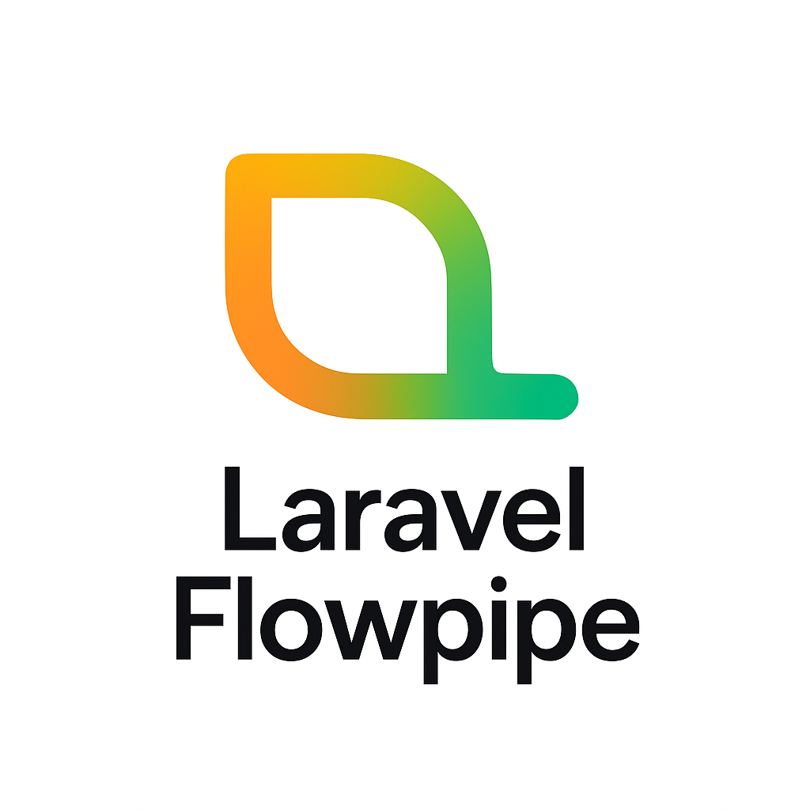

# Laravel Flowpipe

<div align="center">
  
  
  **Composable, traceable and declarative Flow Pipelines for Laravel**
  
  *A modern alternative to Laravel's Pipeline with advanced features for complex workflow management*

  [](https://packagist.org/packages/grazulex/laravel-flowpipe)
  [](https://packagist.org/packages/grazulex/laravel-flowpipe)
  [](https://github.com/Grazulex/laravel-flowpipe/blob/main/LICENSE.md)
  [](https://php.net/)
  [](https://laravel.com/)
  [](https://github.com/Grazulex/laravel-flowpipe/actions)
  [](https://github.com/laravel/pint)
</div>

---

## 🚀 Overview

Laravel Flowpipe is a powerful, modern alternative to Laravel's built-in Pipeline package that provides **composable**, **traceable**, and **declarative** flow pipelines. Perfect for building complex business workflows, data processing pipelines, user registration flows, API integrations, and any scenario where you need reliable, maintainable, and testable step-by-step processing.

## ✨ Key Features

- 🚀 **Fluent API** - Chainable, expressive syntax
- 🔄 **Flexible Steps** - Support for closures, classes, and custom steps  
- 🎯 **Conditional Logic** - Built-in conditional step execution
- 📊 **Tracing & Debugging** - Track execution flow and performance
- 🛡️ **Advanced Error Handling** - Retry, fallback, and compensation strategies
- 🔗 **Step Groups** - Reusable, named collections of steps
- 🎯 **Nested Flows** - Create isolated sub-workflows for complex logic
- 📋 **YAML Support** - Define flows in YAML for easy configuration
- 🧪 **Test-Friendly** - Built-in test tracer for easy testing
- 🎨 **Artisan Commands** - Full CLI support for flow management
- ✅ **Flow Validation** - Validate flow definitions with comprehensive error reporting
- 📈 **Export & Documentation** - Export to JSON, Mermaid, and Markdown

## 📦 Installation

Install the package via Composer:

```bash
composer require grazulex/laravel-flowpipe
```

> **💡 Auto-Discovery**: The service provider will be automatically registered thanks to Laravel's package auto-discovery.

## ⚡ Quick Start

### 🚀 Programmatic API
```php
use Grazulex\LaravelFlowpipe\Flowpipe;

$result = Flowpipe::make()
    ->send('Hello World')
    ->through([
        fn($data, $next) => $next(strtoupper($data)),
        fn($data, $next) => $next(str_replace(' ', '-', $data)),
        fn($data, $next) => $next($data . '!'),
    ])
    ->thenReturn();

// Result: "HELLO-WORLD!"
```

### 📋 YAML Configuration (Recommended)
Laravel Flowpipe supports **declarative flow definitions using YAML files**, making your workflows easy to manage, version, and maintain:

**Create a flow definition** (`flow_definitions/user_registration.yaml`):
```yaml
name: user_registration
description: Complete user registration workflow
steps:
  - type: validation
    rules:
      email: required|email
      password: required|min:8
  - type: closure
    action: App\Actions\CreateUserAccount
  - type: conditional
    condition:
      field: email_verification_required
      operator: equals
      value: true
    then:
      - type: closure
        action: App\Actions\SendVerificationEmail
  - type: group
    name: notifications
metadata:
  version: "1.0"
  author: "Your Team"
```

**Execute the flow**:
```php
use Grazulex\LaravelFlowpipe\Flowpipe;

$result = Flowpipe::fromDefinition('user_registration')
    ->send($userData)
    ->thenReturn();
```

**📁 Organize with step groups** (`flow_definitions/groups/notifications.yaml`):
```yaml
name: notifications
steps:
  - type: closure
    action: App\Actions\SendWelcomeEmail
  - type: closure
    action: App\Actions\CreateNotificationPreferences
```

> **💡 Avantages des fichiers YAML :**
> - ✅ **Configuration déclarative** - Définissez vos workflows sans code
> - ✅ **Réutilisabilité** - Partagez des groupes d'étapes entre différents flux
> - ✅ **Versioning facile** - Trackez les changements dans votre système de contrôle de version
> - ✅ **Collaboration** - Les non-développeurs peuvent modifier les workflows
> - ✅ **Validation** - Validation automatique des définitions avec `php artisan flowpipe:validate`

## 🔧 Requirements

- **PHP 8.3+**
- **Laravel 12.x or 13.x**

## 📚 Complete Documentation

For comprehensive documentation, examples, and advanced usage guides, visit our **Wiki**:

### 📖 **[👉 Laravel Flowpipe Wiki](https://github.com/Grazulex/laravel-flowpipe/wiki)**

The wiki includes:

- **🚀 [Installation & Setup](https://github.com/Grazulex/laravel-flowpipe/wiki/Installation-Setup)**
- **⚙️ [Configuration](https://github.com/Grazulex/laravel-flowpipe/wiki/Configuration)**
- **🎯 [Your First Flow](https://github.com/Grazulex/laravel-flowpipe/wiki/Your-First-Flow)**
- **📋 [Understanding YAML Flows](https://github.com/Grazulex/laravel-flowpipe/wiki/Understanding-YAML-Flows)**
- **🏗️ [YAML Flow Structure](https://github.com/Grazulex/laravel-flowpipe/wiki/YAML-Flow-Structure)**
- **🔧 [PHP Steps](https://github.com/Grazulex/laravel-flowpipe/wiki/PHP-Steps)**
- **🔗 [Step Groups](https://github.com/Grazulex/laravel-flowpipe/wiki/Step-Groups)**
- **🎯 [Conditions & Branching](https://github.com/Grazulex/laravel-flowpipe/wiki/Conditions-Branching)**
- **🛡️ [Error Handling](https://github.com/Grazulex/laravel-flowpipe/wiki/Error-Handling)**
- **🎨 [Artisan Commands](https://github.com/Grazulex/laravel-flowpipe/wiki/Artisan-Commands)**
- **🚀 [Queue Integration](https://github.com/Grazulex/laravel-flowpipe/wiki/Queue-Integration)**
- **📝 [Example: User Registration](https://github.com/Grazulex/laravel-flowpipe/wiki/Example-User-Registration)**

---

## 🤝 Contributing

Please see [CONTRIBUTING.md](CONTRIBUTING.md) for details.

## 🔒 Security

If you discover any security-related issues, please email **jms@grazulex.be** instead of using the issue tracker.

## 📝 Changelog

Please see [RELEASES.md](RELEASES.md) for more information on what has changed recently.

## 📄 License

The MIT License (MIT). Please see [License File](LICENSE.md) for more information.

## 👥 Credits

- **[Jean-Marc Strauven](https://github.com/Grazulex)**
- **[All Contributors](../../contributors)**

## 💬 Support

- 🐛 **[Report Issues](https://github.com/Grazulex/laravel-flowpipe/issues)**
- � **[Discussions](https://github.com/Grazulex/laravel-flowpipe/discussions)**
- � **[Documentation](https://github.com/Grazulex/laravel-flowpipe/wiki)**

---

<div align="center">
  <strong>Laravel Flowpipe</strong> - A modern, powerful alternative to Laravel's built-in Pipeline<br>
  with enhanced features for complex workflow management.
</div>
