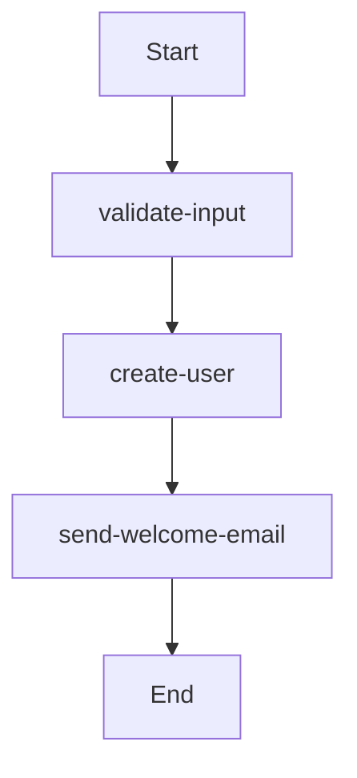

# Artisan Commands

Laravel Flowpipe provides several Artisan commands to help you manage flow definitions and generate boilerplate code.

## Available Commands

### 1. `flowpipe:list`

Lists all available flow definitions in your configured path.

```bash
php artisan flowpipe:list
```

#### Options

- `--detailed` : Show detailed information about each flow (steps, conditions, features)

```bash
php artisan flowpipe:list --detailed
```

#### Example Output

```
Available Flow Definitions:

user-registration
  Description: Complete user registration flow
  Steps: 5
  Conditions: 2
  Features: Email validation, Password hashing, Profile creation

order-processing
  Description: Process customer orders
  Steps: 8
  Conditions: 3
  Features: Payment processing, Inventory check, Shipping calculation
```

### 2. `flowpipe:make-flow`

Creates a new flow definition file with a basic template.

```bash
php artisan flowpipe:make-flow {name}
```

#### Arguments

- `name` : The name of the flow definition file to create

#### Options

- `--template=basic` : Choose template type (basic, conditional, advanced)

#### Examples

```bash
# Create a basic flow
php artisan flowpipe:make-flow user-registration

# Create a conditional flow
php artisan flowpipe:make-flow order-processing --template=conditional

# Create an advanced flow
php artisan flowpipe:make-flow data-processing --template=advanced
```

#### Generated Templates

**Basic Template:**
```yaml
flow: user-registration
description: User registration flow

# Optional: Initial payload to send to the flow
# send: "initial data"

steps:
  # Example: Simple closure step
  - type: closure
    action: uppercase
    
  # Example: Custom step class
  # - step: App\Flowpipe\Steps\YourCustomStep
    
  # Example: Another closure step
  - type: closure
    action: trim
```

**Conditional Template:**
```yaml
flow: order-processing
description: Order processing flow with conditions

# Optional: Initial payload
# send: {"active": true, "name": "John Doe"}

steps:
  # Example: Conditional step with dot notation
  - condition: user.is_active
    then:
      - type: closure
        action: uppercase
      # - step: App\Flowpipe\Steps\SendWelcomeEmailStep
    else:
      - type: closure
        action: lowercase
      # - step: App\Flowpipe\Steps\SendRejectionEmailStep

  # Example: Field-based condition
  - condition:
      field: status
      operator: equals
      value: "approved"
    then:
      - type: closure
        action: trim
```

### 3. `flowpipe:make-step`

Creates a new step class with proper structure and methods.

```bash
php artisan flowpipe:make-step {name}
```

#### Arguments

- `name` : The name of the step class to create

#### Options

- `--namespace=App\Flowpipe\Steps` : Custom namespace for the step class
- `--force` : Overwrite existing step class if it exists

#### Examples

```bash
# Create a basic step
php artisan flowpipe:make-step ValidateInputStep

# Create a step with custom namespace
php artisan flowpipe:make-step PaymentStep --namespace=App\Services\Payment\Steps

# Force overwrite existing step
php artisan flowpipe:make-step ValidateInputStep --force
```

#### Generated Step Class

```php
<?php

namespace App\Flowpipe\Steps;

use Closure;
use Grazulex\LaravelFlowpipe\Contracts\FlowStep;

final class ValidateInputStep implements FlowStep
{
    public function handle(mixed $payload, Closure $next): mixed
    {
        // TODO: Add your logic here

        return $next($payload);
    }
}
```


### 5. `flowpipe:export`

Exports flow definitions to various formats for documentation or analysis.

```bash
php artisan flowpipe:export {flow} {format}
```

#### Arguments

- `flow` : The name of the flow to export
- `format` : The export format (json, mermaid, md)

#### Options

- `--output=` : Specify output file path
- `--include-steps` : Include step class content in export
- `--include-conditions` : Include condition class content in export

#### Examples

```bash
# Export to JSON
php artisan flowpipe:export user-registration json

# Export to Mermaid diagram
php artisan flowpipe:export user-registration mermaid

# Export to Markdown documentation
php artisan flowpipe:export user-registration md

# Export with custom output path
php artisan flowpipe:export user-registration json --output=docs/flows/user-registration.json

# Export with step details
php artisan flowpipe:export user-registration md --include-steps --include-conditions
```

#### Export Formats

**JSON Export:**
```json
{
  "name": "user-registration",
  "description": "User registration flow",
  "steps": [
    {
      "name": "validate-input",
      "class": "App\\Flowpipe\\Steps\\ValidateInputStep"
    }
  ]
}
```

**Mermaid Export:**


**Markdown Export:**
```markdown
# User Registration Flow

## Description
User registration flow

## Steps
1. **validate-input** - App\Flowpipe\Steps\ValidateInputStep
2. **create-user** - App\Flowpipe\Steps\CreateUserStep
3. **send-welcome-email** - App\Flowpipe\Steps\SendWelcomeEmailStep
```

## Command Tips

### 1. Batch Operations

```bash
# List all flows and export them
php artisan flowpipe:list --detailed | grep -E "^[a-z-]+" | while read flow; do
    php artisan flowpipe:export "$flow" md --output="docs/flows/$flow.md"
done
```

### 2. Development Workflow

```bash
# Create a new flow
php artisan flowpipe:make-flow user-onboarding

# Create required steps
php artisan flowpipe:make-step CreateUserStep
php artisan flowpipe:make-step SendWelcomeEmailStep
php artisan flowpipe:make-step SetupProfileStep

# Create conditions
php artisan flowpipe:make-condition EmailValidCondition
php artisan flowpipe:make-condition ProfileCompleteCondition

# Test the flow
php artisan flowpipe:list --detailed

# Export documentation
php artisan flowpipe:export user-onboarding md
```

### 3. Documentation Generation

```bash
# Generate documentation for all flows
mkdir -p docs/flows
php artisan flowpipe:list | tail -n +3 | while read flow; do
    php artisan flowpipe:export "$flow" md --output="docs/flows/$flow.md" --include-steps
done
```

## Error Handling

### Common Errors

1. **Flow not found**: Check if the flow definition file exists
2. **Invalid format**: Ensure you're using supported formats (json, mermaid, md)
3. **Permission errors**: Check file permissions for output directories
4. **Class not found**: Ensure step and condition classes exist

### Debug Mode

Enable verbose output for troubleshooting:

```bash
php artisan flowpipe:list -v
php artisan flowpipe:export user-registration json -vvv
```

## Extending Commands

You can extend the existing commands or create new ones:

```php
<?php

namespace App\Console\Commands;

use Grazulex\LaravelFlowpipe\Console\Commands\FlowpipeCommand;

class CustomFlowpipeCommand extends FlowpipeCommand
{
    protected $signature = 'flowpipe:custom {action}';
    protected $description = 'Custom flowpipe command';

    public function handle()
    {
        // Your custom logic here
    }
}
```

Register your custom command in `app/Console/Kernel.php`:

```php
protected $commands = [
    \App\Console\Commands\CustomFlowpipeCommand::class,
];
```
