# Artisan Commands

Laravel Flowpipe provides several Artisan commands to help you manage flow definitions and generate boilerplate code.

## Available Commands

### 1. `flowpipe:list`

Lists all available flow definitions in your configured path.

```bash
php artisan flowpipe:list
```

#### Options

- `--detailed` : Show detailed information about each flow (steps, conditions, features)

```bash
php artisan flowpipe:list --detailed
```

#### Example Output

```
Available Flow Definitions:

user-registration
  Description: Complete user registration flow
  Steps: 5
  Conditions: 2
  Features: Email validation, Password hashing, Profile creation

order-processing
  Description: Process customer orders
  Steps: 8
  Conditions: 3
  Features: Payment processing, Inventory check, Shipping calculation
```

### 2. `flowpipe:validate`

Validates flow definition files to ensure they are correctly structured and all references are valid.

```bash
php artisan flowpipe:validate
```

#### Options

- `--path=` : Path to specific flow definition file to validate
- `--all` : Validate all flow definitions in the configured directory
- `--format=table` : Output format (table, json)

#### Examples

```bash
# Validate all flows with table output
php artisan flowpipe:validate --all

# Validate specific flow
php artisan flowpipe:validate --path=user-registration.yaml

# Get JSON output for programmatic processing
php artisan flowpipe:validate --all --format=json
```

#### Example Output

**Table Format:**
```
┌─────────────────────┬─────────┬────────┬──────────┐
│ Flow                │ Status  │ Errors │ Warnings │
├─────────────────────┼─────────┼────────┼──────────┤
│ UserProcessingFlow  │ ✅ Valid │ 0      │ 0        │
│ PaymentFlow         │ ✅ Valid │ 0      │ 1        │
│ InvalidFlow         │ ❌ Invalid │ 3      │ 0        │
└─────────────────────┴─────────┴────────┴──────────┘

Errors in 'InvalidFlow':
  - Step 1: Unsupported step type 'invalid_type'
  - Step 2: Closure step missing 'action' field
  - Step 3: Group 'non_existent_group' not found
```

**JSON Format:**
```json
{
  "valid": false,
  "flows": [
    {
      "name": "UserProcessingFlow",
      "valid": true,
      "errors": [],
      "warnings": [],
      "error_count": 0,
      "warning_count": 0
    }
  ],
  "summary": {
    "total": 3,
    "valid": 2,
    "invalid": 1,
    "errors": 3,
    "warnings": 1
  }
}
```

### 3. `flowpipe:run`

Runs a flow definition from YAML with optional payload.

```bash
php artisan flowpipe:run {flow}
```

#### Arguments

- `flow` : The name of the flow to run

#### Options

- `--payload=` : Initial payload as JSON string

#### Examples

```bash
# Run a flow without payload
php artisan flowpipe:run user-registration

# Run a flow with JSON payload
php artisan flowpipe:run user-registration --payload='{"name":"John","email":"john@example.com"}'
```

### 4. `flowpipe:make-flow`

Creates a new flow definition file with a basic template.

```bash
php artisan flowpipe:make-flow {name}
```

#### Arguments

- `name` : The name of the flow definition file to create

#### Options

- `--template=basic` : Choose template type (basic, conditional, advanced)

#### Examples

```bash
# Create a basic flow
php artisan flowpipe:make-flow user-registration

# Create a conditional flow
php artisan flowpipe:make-flow order-processing --template=conditional

# Create an advanced flow
php artisan flowpipe:make-flow data-processing --template=advanced
```

#### Generated Templates

**Basic Template:**
```yaml
flow: user-registration
description: User registration flow

# Optional: Initial payload to send to the flow
# send: "initial data"

steps:
  # Example: Simple closure step
  - type: closure
    action: uppercase
    
  # Example: Custom step class
  # - step: App\Flowpipe\Steps\YourCustomStep
    
  # Example: Another closure step
  - type: closure
    action: trim
```

**Conditional Template:**
```yaml
flow: order-processing
description: Order processing flow with conditions

# Optional: Initial payload
# send: {"active": true, "name": "John Doe"}

steps:
  # Example: Conditional step with dot notation
  - condition: user.is_active
    then:
      - type: closure
        action: uppercase
      # - step: App\Flowpipe\Steps\SendWelcomeEmailStep
    else:
      - type: closure
        action: lowercase
      # - step: App\Flowpipe\Steps\SendRejectionEmailStep

  # Example: Field-based condition
  - condition:
      field: status
      operator: equals
      value: "approved"
    then:
      - type: closure
        action: trim
```

### 5. `flowpipe:make-step`

Creates a new step class with proper structure and methods.

```bash
php artisan flowpipe:make-step {name}
```

#### Arguments

- `name` : The name of the step class to create

#### Options

- `--namespace=App\Flowpipe\Steps` : Custom namespace for the step class
- `--force` : Overwrite existing step class if it exists

#### Examples

```bash
# Create a basic step
php artisan flowpipe:make-step ValidateInputStep

# Create a step with custom namespace
php artisan flowpipe:make-step PaymentStep --namespace=App\Services\Payment\Steps

# Force overwrite existing step
php artisan flowpipe:make-step ValidateInputStep --force
```

#### Generated Step Class

```php
<?php

namespace App\Flowpipe\Steps;

use Closure;
use Grazulex\LaravelFlowpipe\Contracts\FlowStep;

final class ValidateInputStep implements FlowStep
{
    public function handle(mixed $payload, Closure $next): mixed
    {
        // TODO: Add your logic here

        return $next($payload);
    }
}
```


### 6. `flowpipe:export` - Enhanced with Group Colors

Exports flow definitions and groups to various formats for documentation or analysis. Now supports enhanced Mermaid diagrams with rich color coding for different step types.

```bash
php artisan flowpipe:export {flow} {--format=json} {--output=} {--type=flow}
```

#### Arguments

- `flow` : The name of the flow or group to export

#### Options

- `--format=json` : Export format (json, mermaid, md)
- `--output=` : Output file path (optional)
- `--type=flow` : Type to export (flow, group)

#### Enhanced Color Coding

The Mermaid export now supports rich color coding for different step types:

- **Groups**: Blue theme (`📦 Group elements`)
- **Nested Flows**: Light green theme (`🔄 Nested elements`)
- **Conditional Steps**: Orange theme (`❓ Conditional elements`)
- **Transform Steps**: Pink theme (`🔄 Transform elements`)
- **Validation Steps**: Green theme (`✅ Validation elements`)
- **Cache Steps**: Yellow theme (`💾 Cache elements`)
- **Batch Steps**: Purple theme (`📊 Batch elements`)
- **Retry Steps**: Red theme (`🔄 Retry elements`)

#### Examples

```bash
# Export flow to JSON
php artisan flowpipe:export user-registration --format=json

# Export flow to enhanced Mermaid diagram
php artisan flowpipe:export user-registration --format=mermaid

# Export group with color coding
php artisan flowpipe:export user-validation --type=group --format=mermaid

# Export to Markdown documentation
php artisan flowpipe:export user-registration --format=md

# Export with custom output path
php artisan flowpipe:export user-registration --format=json --output=docs/flows/user-registration.json

# Export group to documentation
php artisan flowpipe:export data-processing --type=group --format=md --output=docs/groups/data-processing.md
```

#### Export Formats

**JSON Export:**
```json
{
  "flow": "user-registration",
  "description": "User registration flow",
  "steps": [
    {
      "type": "group",
      "name": "user-validation"
    },
    {
      "type": "nested",
      "steps": [
        {
          "type": "closure",
          "action": "hash_password"
        }
      ]
    }
  ]
}
```

**Enhanced Mermaid Export:**


**Markdown Export:**
```markdown
# Flow Documentation: user-registration

## 📋 Basic Information

- **Flow Name**: `user-registration`
- **Type**: `flow`
- **Description**: User registration flow with validation and processing
- **Generated**: 2024-01-15 10:30:00

## 🌊 Flow Visualization

```mermaid
flowchart TD
    classDef groupStyle fill:#e1f5fe,stroke:#01579b,stroke-width:2px,color:#01579b
    classDef nestedStyle fill:#f9fbe7,stroke:#33691e,stroke-width:2px,color:#33691e
    classDef startEndStyle fill:#e8f5e8,stroke:#2e7d32,stroke-width:3px,color:#2e7d32
    
    Start([🚀 Start: Flow: user-registration])
    Start:::startEndStyle
    Step1[📦 Group: user-validation]
    Step1:::groupStyle
    Start --> Step1
    Step2[🔄 nested: process]
    Step2:::nestedStyle
    Step1 --> Step2
    End([🏁 End])
    End:::startEndStyle
    Step2 --> End
```



## 🔧 Detailed Steps

### Step 1

**Type**: Group Step

**Action**: `user-validation`

### Step 2

**Type**: Nested Step

**Action**: `process`
```

## Command Tips

### 1. Batch Operations

```bash
# List all flows and export them
php artisan flowpipe:list --detailed | grep -E "^[a-z-]+" | while read flow; do
    php artisan flowpipe:export "$flow" md --output="docs/flows/$flow.md"
done
```

### 2. Development Workflow

```bash
# Create a new flow
php artisan flowpipe:make-flow user-onboarding

# Create required steps
php artisan flowpipe:make-step CreateUserStep
php artisan flowpipe:make-step SendWelcomeEmailStep
php artisan flowpipe:make-step SetupProfileStep

# Create conditions
php artisan flowpipe:make-condition EmailValidCondition
php artisan flowpipe:make-condition ProfileCompleteCondition

# Test the flow
php artisan flowpipe:list --detailed

# Export documentation
php artisan flowpipe:export user-onboarding md
```

### 3. Documentation Generation

```bash
# Generate documentation for all flows
mkdir -p docs/flows
php artisan flowpipe:list | tail -n +3 | while read flow; do
    php artisan flowpipe:export "$flow" md --output="docs/flows/$flow.md" --include-steps
done
```

## Error Handling

### Common Errors

1. **Flow not found**: Check if the flow definition file exists
2. **Invalid format**: Ensure you're using supported formats (json, mermaid, md)
3. **Permission errors**: Check file permissions for output directories
4. **Class not found**: Ensure step and condition classes exist

### Debug Mode

Enable verbose output for troubleshooting:

```bash
php artisan flowpipe:list -v
php artisan flowpipe:export user-registration json -vvv
```

## Extending Commands

You can extend the existing commands or create new ones:

```php
<?php

namespace App\Console\Commands;

use Grazulex\LaravelFlowpipe\Console\Commands\FlowpipeCommand;

class CustomFlowpipeCommand extends FlowpipeCommand
{
    protected $signature = 'flowpipe:custom {action}';
    protected $description = 'Custom flowpipe command';

    public function handle()
    {
        // Your custom logic here
    }
}
```

Register your custom command in `app/Console/Kernel.php`:

```php
protected $commands = [
    \App\Console\Commands\CustomFlowpipeCommand::class,
];
```
